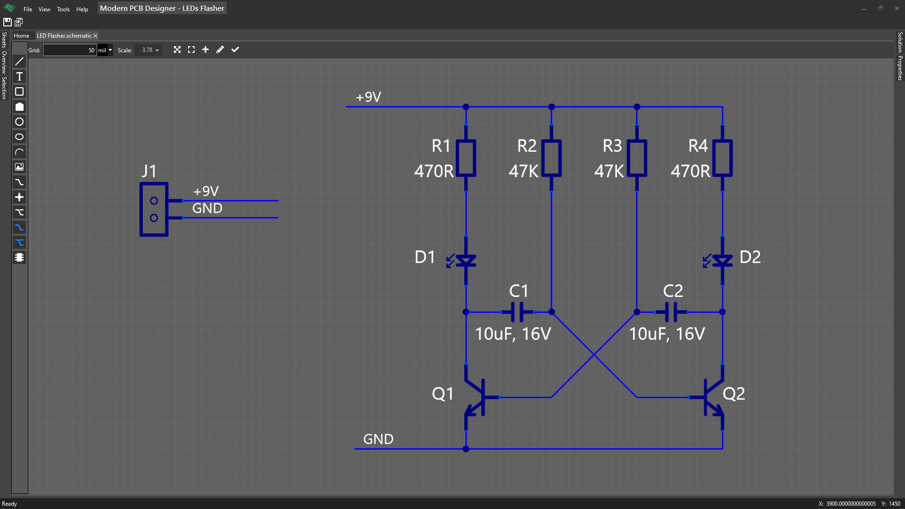

# Creating the schematic

## Placing components

We have to place our components. So in the toolbox, click on **Add new part**, choose the part you want to place, rotate the part with **[SPACE]**, mirror it on X-axis using **[X]** or **[Alt + X]** from keyboard, or mirror on Y-axis using **[Y]** or [**Alt + Y]** key.

Place all the parts and position them.

## Wiring the schematic

In the toolbox, click on **Net wire**, then click on a pin to start a net, press **[SPACE]** to change wiring modes, then click on the other pin to end it. Keep wiring the entire schematic.

## Naming nets in the schematic

You can name a net in the schematic. I recommend you to name any net that is important. For example, VCC, GND, but also any net that goes to the RESET pin of your microcontroller or any feedback pin in your power supply.

Named nets are used for assigning them to net classes and also to be easier to view them on the board.

So, you name a net using a label, and for this, you click on **Net label** in the toolbox on the left and then you place this label on the net wire. Then, you select this label and from **Properties** tool window type a new name for the net.

## Defining net classes in the schematic

A net class is in fact a group for a net to mark it with. You must define a net class first. 

Go in the schematic properties by clicking **Properties** in the top-bar. 

Click on **Net classes** and you will have an empty tree on the left. 

Here you can manage the net classes by adding, editing and removing them. 

You can also create net groups and add net classes to these groups.

On the right, there is a list with all the named nets from the schematic. Only the named nets will be in this list; if you are interested in a particular net that you want to assign it to a class, you have to go into the schematic and give it a name.

Use the arrow buttons to assign and remove nets to and from the selected class.

Click on **Show schematic** when you're done.

**Image of the finished schematic**

